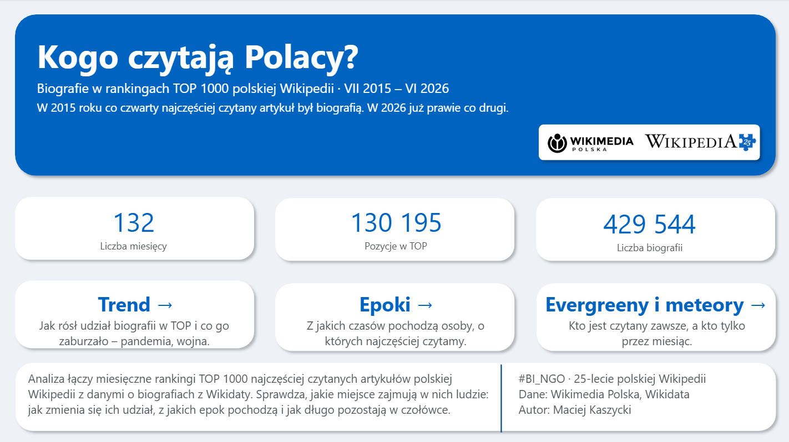
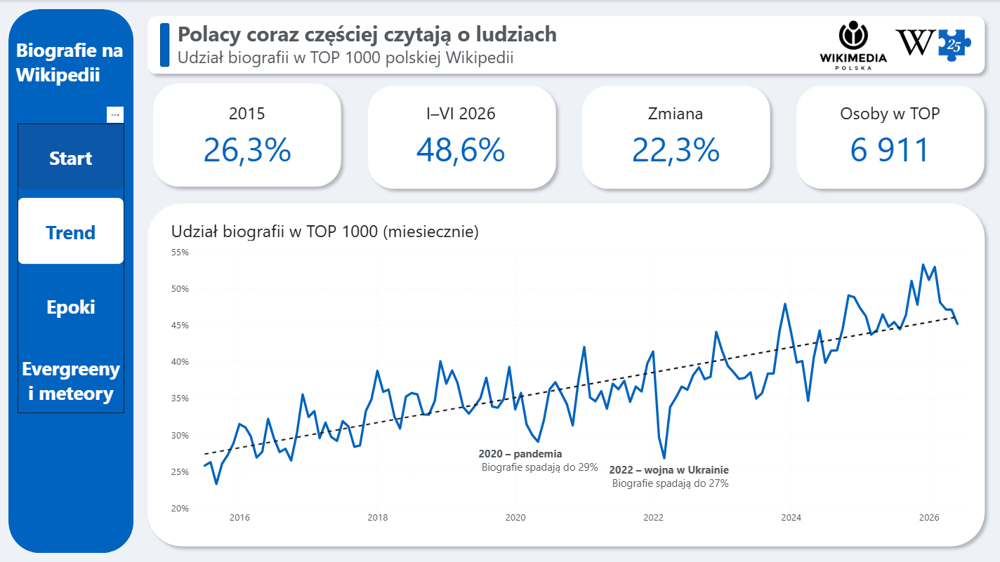
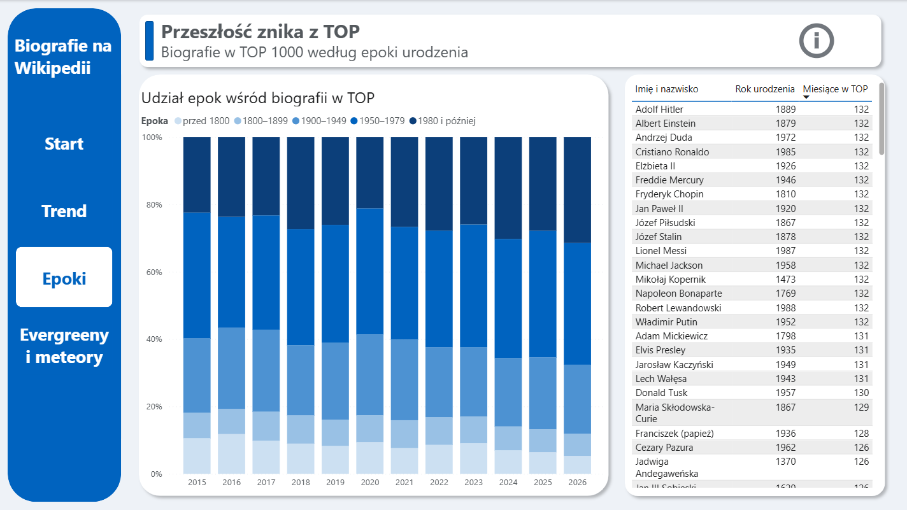
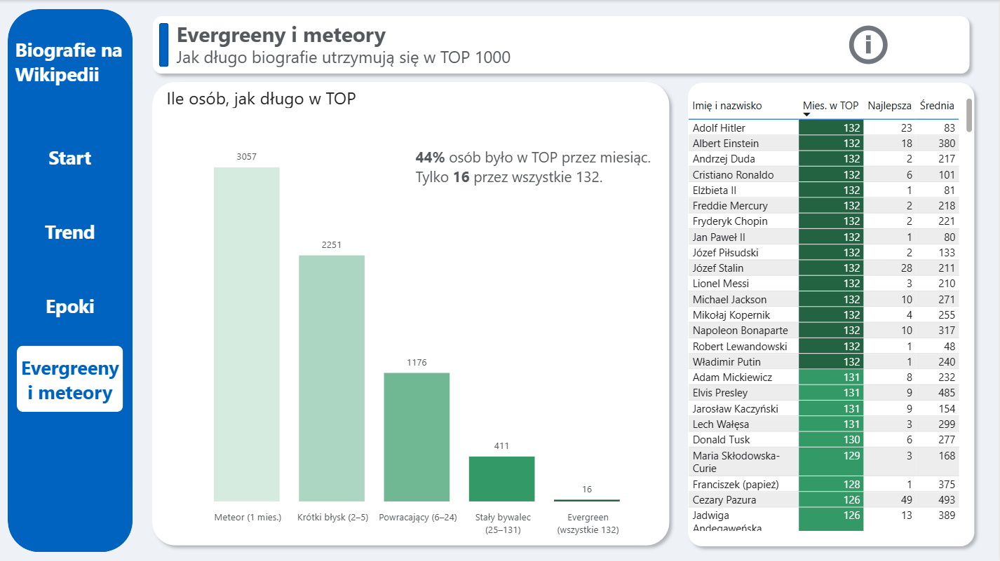
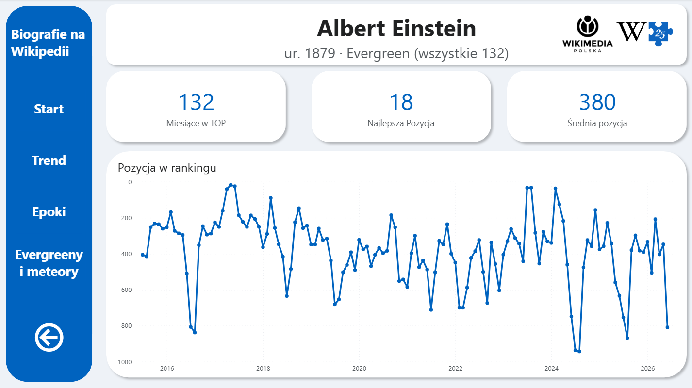
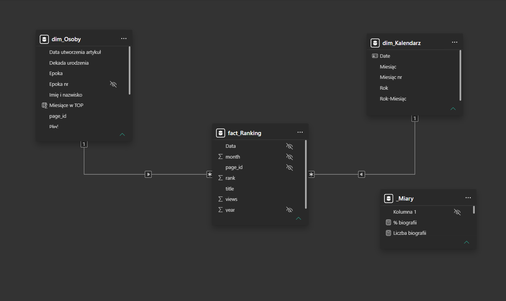

# Who do Poles read about?

Biographies in the Polish Wikipedia TOP 1000, July 2015 – June 2026. A Power BI dashboard.

I built this for #BI_NGO 2026, a data visualization challenge organised by [Język Danych](https://bingo.jezykdanych.pl/) and Wikimedia Polska for the 25th anniversary of the Polish Wikipedia.

The question was simple: how much of what Poles read on Wikipedia is about people, and which people. To answer it I joined the monthly TOP 1000 most-viewed articles (132 months) with a list of 430k biographies from Wikidata.

The report is in Polish.



## Findings

- In 2015 biographies took 26.3% of the TOP 1000. In the first half of 2026 they took 48.6%, so almost half of the most-read articles are now about people.
- The share drops when the news takes over. The two lowest points after 2015 are spring 2020 (COVID) and March 2022 (Russian invasion of Ukraine).
- Readers care less about the distant past. People born before 1800 went from 11% to 5% of biographies in the TOP, and people born after 1980 went from 20% to 29%.
- Most people are there only briefly. Of the 6,911 people who made the TOP 1000 at least once, 44% stayed for a single month. Only 16 were there in all 132 months, including Copernicus, Chopin, Einstein, Napoleon, John Paul II, Freddie Mercury, Messi and Lewandowski.

## Report pages

**Start** is the cover page with the scale of the data and buttons to each section.

**Trend** shows the monthly share of biographies with a trend line and notes on the two dips.

**Epoki** (eras) splits the biographies by the person's birth era. Clicking an era filters the table of the most-read people from that period.

**Evergreeny i meteory** (evergreens and meteors) groups people by how many months they spent in the TOP 1000.

**Karta osoby** (person card) is a hidden drill-through page. Right-click anyone in a table to see their monthly rank history.






## Data

Both files come from the #BI_NGO 2026 repository provided by Wikimedia Polska:

- `5-top_1000_artykulow_monthly.csv`: monthly TOP 1000 articles of the Polish Wikipedia (about 130k rows)
- `9-biografie.tsv`: people with a Polish Wikipedia article, from a Wikidata query in July 2026 (about 432k rows)

The pageview data and Wikidata are CC0, and Wikipedia content is CC BY-SA 4.0. I don't include the raw files here, so download them from the challenge repository.

## How it's built

### Power Query

The ranking file needed very little work. The biography file needed more:

- Some people had several rows because Wikidata stores more than one birth date for them. I sorted the rows and then removed duplicates on `page_id`. The sort is wrapped in `Table.Buffer`, because without it Power Query doesn't guarantee which row it keeps.
- The `?dateOfBirth` column breaks for years below 100 (year 55 shows up as 1955), so I used the separate `?year` column instead.
- Decade and century came as text like `1970.0`, which fails to convert under the Polish locale. I converted them with the English (US) locale.
- I filtered out rows with an empty `page_id` in both tables.
- I added a gender column and a birth era column (5 groups) with a numeric column for sort order.

That left 429,544 unique people. I checked the main numbers against the same calculations in pandas.

### Model

A star schema: `fact_Ranking` (one row per article per month) with two dimensions, `dim_Osoby` (people) and `dim_Kalendarz` (a date table made in DAX). The relationships are one-to-many and filter in one direction.



Most articles in the ranking aren't biographies, so they have no match in `dim_Osoby`. I used that on purpose: a ranking row counts as a biography when its person isn't blank.

### DAX

Share of biographies:

```dax
Pozycje biografii =
CALCULATE ( [Pozycje w TOP], NOT ISBLANK ( dim_Osoby[page_id] ) )

% biografii = DIVIDE ( [Pozycje biografii], [Pozycje w TOP] )
```

Number of distinct people. `COUNTROWS` would count every month a person appeared, so this uses `DISTINCTCOUNT`:

```dax
Osoby w TOP =
CALCULATE ( DISTINCTCOUNT ( fact_Ranking[page_id] ), NOT ISBLANK ( dim_Osoby[page_id] ) )
```

Months in the TOP and the segment are calculated columns, so they can go on an axis or in a legend:

```dax
Miesiące w TOP = COUNTROWS ( RELATEDTABLE ( fact_Ranking ) )

Segment =
SWITCH ( TRUE (),
    ISBLANK ( dim_Osoby[Miesiące w TOP] ), BLANK (),
    dim_Osoby[Miesiące w TOP] = 1,    "Meteor (1 mies.)",
    dim_Osoby[Miesiące w TOP] <= 5,   "Krótki błysk (2–5)",
    dim_Osoby[Miesiące w TOP] <= 24,  "Powracający (6–24)",
    dim_Osoby[Miesiące w TOP] <= 131, "Stały bywalec (25–131)",
    "Evergreen (wszystkie 132)"
)
```

### Design

The colours come from the Wikimedia Legacy palette, which I put into a custom theme (`theme/wikimedia_legacy_theme.json`). Eras use a blue scale and segments a green one, both getting darker along the order. The table on the segments page uses the same greens as the chart.

## Limitations

- An article counts as a biography only if it's linked to a person in Wikidata. Newer articles may be better linked, which could account for part of the growth.
- 2015 starts in July and 2026 ends in June. That's why I compare shares and not raw counts.
- Months in the TOP are counted only within this 11-year window, so someone popular mostly before 2015 can show up as a "meteor".

## Running it

Open `report/Biografie_Wikipedia.pbix` in Power BI Desktop. The data is already in the file.

## Author

Maciej Kaszycki
[LinkedIn](https://www.linkedin.com/in/maciej-kaszycki/)
